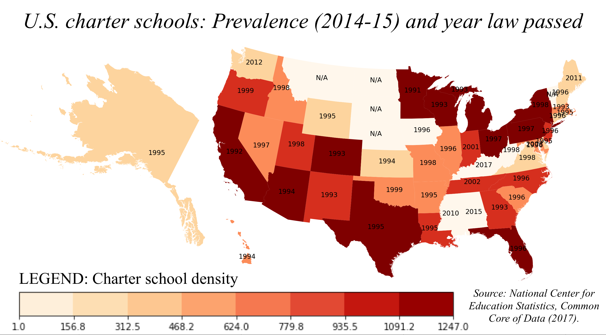

# Stratification through organizational identity:
## Do charter schools' ideologies reinforce social inequalities?

### Generally useful scripts (in "scripts" folder):
#### Initializing virtual machine (VM) environments
- `jetstream-playbook.yaml`: Sets up VM user access permissions, such as with Jetstream. 
- `init_VM.sh`: Simple script to install essential data science packages to a new VM.
- `charter-school-notebook-server`: Creates Jupyter notebook using custom port and `datascience-notebook` docker environment.
- For more information on configuring such an environment, contact me at jhaber@berkeley.edu. 
#### Downloading and parsing 
- `scraping_URLs.py`: Given search terms, scrapes the best URL using a combination of Google Places API (you'll need an API key from Google) and automated Google searching (Thanks Mario Vilas!).
- `wget_parallel.py`: Highly customized application of GNU software `parallel` and `wget` to efficiently download to disk the static web contents (no JavaScript) of all URLs in a given CSV.
- `webparser_mp.py`: Uses `BeautifulSoup` and `multiprocessing.Pool` to clean, filter, and merge webtext into various analysis-ready formats. Also uses custom dictionaries to count the number of matches for a given school/ organization/ website. 
- `data_prep.py`: Loads text from files on disk into `Pandas` DataFrame and saves as CSV. Customized to work with large amounts of data and/or computational settings with limited system memory. 
#### Text analysis
- `analysis_prelim.ipynb`: Applies various computational text analysis methods (histograms, topic models, word embeddings) to a small sample of charter schools' website texts.

### Useful educational data files (in "data" folder):
- `pubschools_merged_2015.csv`: Complete list of all US public schools open since 1998--the first year information on the population of charter schools was collected. This data is based on the Ed. Dept's Public School Universe Survey (https://nces.ed.gov/ccd/pubschuniv.asp). 
- `charter_URLs_2016.csv`: List of all charter schools open in the 2016-17 school year, with their URLs and various other information. Also based on the Ed. Dept's data (see link in preceding item). 

## Description
This repo is for data and code related to my dissertation research on charter school identities as analyzed from mission statements (MSs) on their public websites. The code is in Python 3 Jupyter Notebooks and Python scripts.

I am working to categorize identities using text analytic methods including Natural Language Processing (NLP; e.g., distinctive words, concordances), custom dictionaries, and unsupervised approaches (e.g., Structural Topic Models, Word Embeddings). I will then use regression models to connect identity patterns with community characteristics (e.g., class, race, political leanings).

At present this research is cross-sectional, looking at the population of currently open U.S. charter schools, but plans are in the works to get longitudinal MS data using the Internet Archive. I will use these data to examine survival and geographic dispersion of the different identity categories over time.

For lots more details on my data and method, see my [April 2017 pre-registration with the Open Science Foundation](https://osf.io/zgh5u/), especially the [Prereg Challenge form](https://osf.io/zgh5u/register/565fb3678c5e4a66b5582f67).

If you have questions, exciting ideas or comments, or want to congratulate me on something, do email me at jhaber@berkeley.edu. Thanks!

Preliminary visuals showing charter school density by state in 2014 and charter philosophy with community income in 2018:

